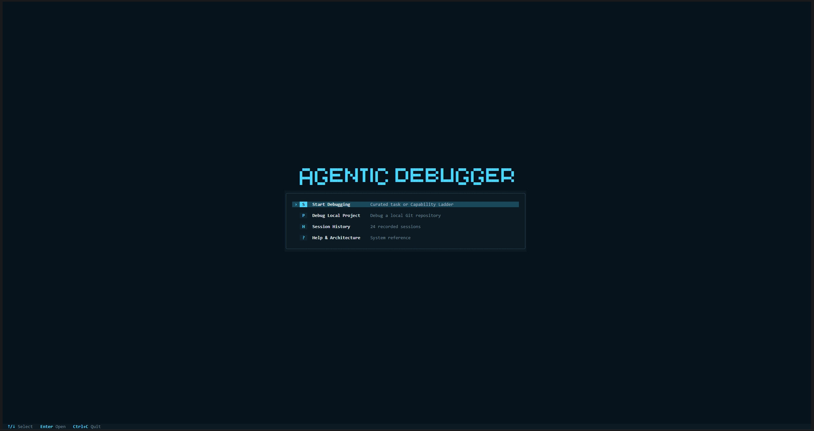

# Agentic Debugger

Evidence-driven software repair for Python projects.



Agentic Debugger is a Python 3.11+ research prototype that combines a single
controller, typed tools, bounded PDB sessions, disposable workspaces,
unified-diff patching, immutable event journals, and an independent verifier.
The terminal application exposes the same repair and replay path used by the
research harness.

## Highlights

- Debug curated tasks or a local Git project without modifying the source tree.
- Inspect bounded source, tests, stack frames, locals, and safe expressions.
- Apply model-authored patches through strict path and diff validation.
- Accept repairs only after independent fail-to-pass and pass-to-pass checks.

## Quick start

```powershell
python -m pip install -e ".[app,test]"
python -m agentic_debugger.ui --doctor
python -m agentic_debugger.ui
```

`--doctor` reports local application and model-provider readiness. The first
curated task is an offline deterministic demo and contacts no provider.

Run the scientific demo directly:

```powershell
python -m agentic_debugger.demo --output-dir demo-out --task-id curated-off-by-one-002
```

List or export session history without opening the UI:

```powershell
agentic-debugger --list-sessions
agentic-debugger --export-session SESSION_ID --output session-report.md
```

## How it works

```text
task + policy
  -> single deterministic controller
  -> source, test, PDB, and patch tools
  -> disposable workspace
  -> independent verifier
  -> immutable events, replay, and cleanup proof
```

The verifier is the correctness authority. A model, controller, or operator
claim is never treated as proof of a repair.

## Model providers

Live execution is explicit. The application supports Ollama Cloud, OpenCode
Go, CommandCode GOAT, and operator-configured command profiles. Credentials
are not written to tracked source, command arguments, journals, or evidence;
see [the provider architecture](docs/architecture/model-providers-v1.md).

## Current status

The accepted research cycle and Local Application V1 are complete. Release tag
`v0.1.0` identifies the accepted release checkpoint; current source also
contains later application and repository cleanup.

Selected accepted evidence includes a verifier-resolved real-provider product
session, three verifier-resolved exact-PDB ladder tasks, two authoritative
Level-32 resolutions in a frozen 15-model matrix, a leakage-clean base-14B
5/5 result, and project-tuned 7B performance of 8/8 on task-disjoint QuixBugs
validation. These results have different scopes and are not interchangeable.
See the [results and evidence index](docs/results-index.md) for evidence paths
and mandatory qualifiers.

Verify the public evidence locally with:

```powershell
python scripts/verify_public_evidence.py --output public-evidence-attestation.json
```

This gate checks a representative offline repair, independent verification,
replay and cleanup, the frozen R6 chain of custody, deterministic professor
trace regeneration, and leakage auditing. It does not rerun external campaigns.

## Documentation

- [Application architecture](docs/architecture/local-application-v1.md)
- [Results and evidence index](docs/results-index.md)
- [Final technical report](docs/final-report.md)
- [Project closeout](docs/project-closeout.md)
- [Experiment families](experiments/README.md)
- [Research index](research/README.md)
- [Closed roadmap](TODO.md)
- [Superseded material](outdated/docs-archive/)
- [Historical status log](outdated/docs-archive/status/README-historical-status-log-through-2026-08-07.md)

## Development

```powershell
python -m pytest <affected-test-path> -q
python -m compileall agentic_debugger scripts
```

Generated runs, model checkpoints, provider credentials, external datasets,
and review packages must not be committed. Real-provider, WSL, and
license-gated dataset campaigns are not ordinary regression tests.

See [CONTRIBUTING.md](CONTRIBUTING.md) for contribution rules and
[SECURITY.md](SECURITY.md) for private vulnerability reporting.

## License

No open-source license is currently granted. The repository may be inspected,
but reuse and redistribution require permission from the copyright holder.
Add an explicit `LICENSE` before presenting the project as open source.
